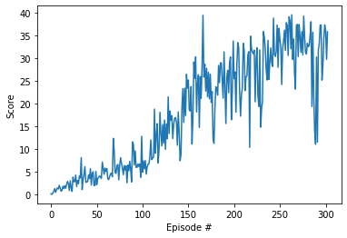

# Project 2: Continuous Control - Report

### Introduction

This report describes my approach to solve the project "p2_continuous-control".
I choose to solve Version 1, because I am a new comer to rl and it seemed more appropriate
In order to solve the challenge I used my collected knowledge, the paper "Continuous Control with Deep Learning"
by Lilicrap, Philip etc. and internet research.
This attempt is my second architecture to solve the problem. I streamlined my first code and made changes.

### DDPG (Deep Deterministic Policy Gradients): Working Principle

Source: https://towardsdatascience.com/deep-deterministic-policy-gradients-explained-2d94655a9b7b

The DDPG uses four neural networks: a Q network, a deterministic policy network, a target Q network,
and a target policy network.

The Q network and policy network work very much like simple Advantage Actor-Critic. The main difference in DDPG is, 
that the Actor directly maps states to actions (the output of the network directly the output) 
instead of outputting the probability distribution across a discrete action space
The target networks are time-delayed copies of their original networks that slowly track the learned networks. 
Thereby the networks improve stability in learning by using these target value networks .

The DDPG uses four technqiues to optimize its learning:

1. Experience replay:

During each trajectory roll-out, all the experience tuples (state, action, reward, next_state) are saved
and store them in a finite-sized cache — the “replay buffer.” 
Then, random mini-batches of experience are sampled from the replay buffer.

2. Actor & Critic network updates:

The next-state Q values are calculated with the target value network and target policy network.

3. Target network updates:

A copy of the target network parameters are made to slowly track those of the learned networks via “soft updates,”

4. Exploration:

For continuous action spaces, exploration is done via adding noise to the action itself. 
As in the DDPG paper, the Ornstein-Uhlenbeck Process is used to add noise to the action output 
The Ornstein-Uhlenbeck Process generates noise that is correlated with the previous noise, as to prevent the noise 
from canceling out or “freezing” the overall dynamics.

### Hyperparameters

I used the classic hyperparameters to solve the environment
- Replay Buffer Size = 1e6
- Mini Batch Size = 128
- TAU (for soft-updaze of the target parameters) = 1e-3
- Learning Rate Actor = 1e-4
- Learning Rate Critic = 1e-4
- Noise = Ornstein-Uhlenbeck
- Discount Factor = 0.99

### Actor Model

The network has a two hidden layers 128 x 128 and uses batch normalization after the first and the second hidden layer.

### Critic Model

The network has a two hidden layers 128 x 128 and uses batch normalization after the first and the second hidden layer.

#### Results

The environment was solved in over 300 episodes. 
Analyzing the given graph we see that first the learning starts quite linearly. But after approximately 120 episodes we get a rising fluctuation between the single episodes.
The aimed goal of series of 30 was reached after 300 episodes. 

#### Further Improvements

1) Tune the hyperparameters to reach a higher reward even faster
2) Using prioritized replay buffer
3) Adjusting the rewards (i.e. negative rewards for discouraging the agent)
4) Solving V2 of the project